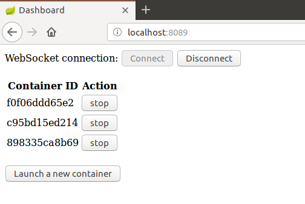
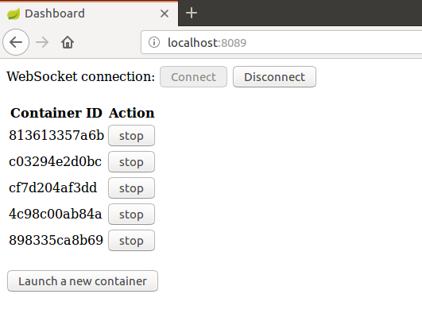
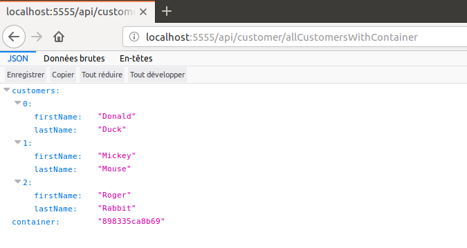

# tiergarten-carmina
I present here a microservice-oriented demo of basic ZooKeeper functions. A dashboard allows to stop and start containerized instances of a service. This version uses Docker containers.

Here are the prerequisites for running the complete application:

A recent Linux version (I used Ubuntu 16.04)

A recent Apache Maven version installed (I used 3.3.9)

A recent Docker version installed (I used 17.12.1-ce)

# 1. Preparation

## 1.1 Images creation

In each of subdirectories: 
customer-server
config-server
eureka-server
zuul-server

run the command: `[sudo] mvn clean package docker:build`.

It creates all Spring images. The non Spring image zookeeper will be pulled from a Docker repository.

## 1.2 JAR file creation

In subdirectory cluster-monitor run the command `mvn clean package`. This creates the JAR file needed for running cluster-monitor as a non containerized Spring Boot application.

# 2. Running the application

## 2.1 Running containers
To start the application go to docker subdirectory and run the command: `[sudo] docker-compose up`.

All running Spring containers can be seen on Eureka port 8761.

## 2.2 Running cluster-monitor
Wait for all containers to be up and running then in subdirectory cluster-monitor run the command `mvn spring-boot:run`. Note that cluster-monitor itself is not containerized.

Then connect to dashboard on localhost:8089 by clicking **connect**. It will return a display like:



Start some new containers by clicking **Launch a new container**. Wait to see the new container Ids appear like on this screen shot:



Then open a new browser window and enter this URI:

```
localhost:5555/api/customer/allCustomersWithContainer
```
It will return a display like:



Note that for each update the container Id changes in a round-robin way. Customer-server is a dummy server that display always the same response except for container Id.

To stop a container click the **Stop**.

Note that all customer server processes created keep running even if cluster-monitor itself is terminated.


